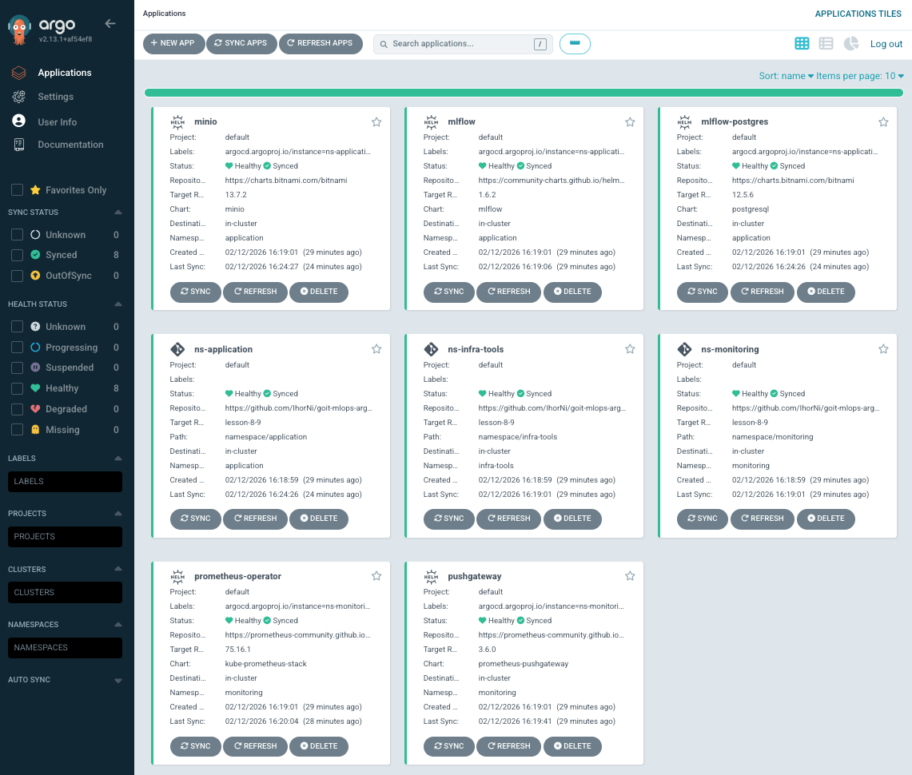
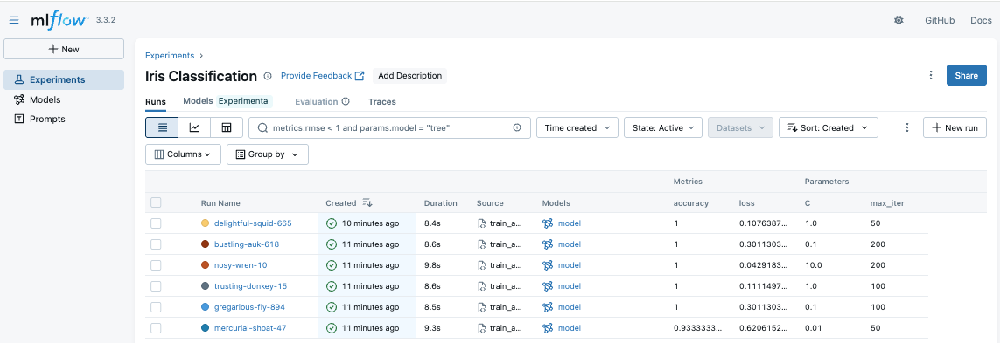
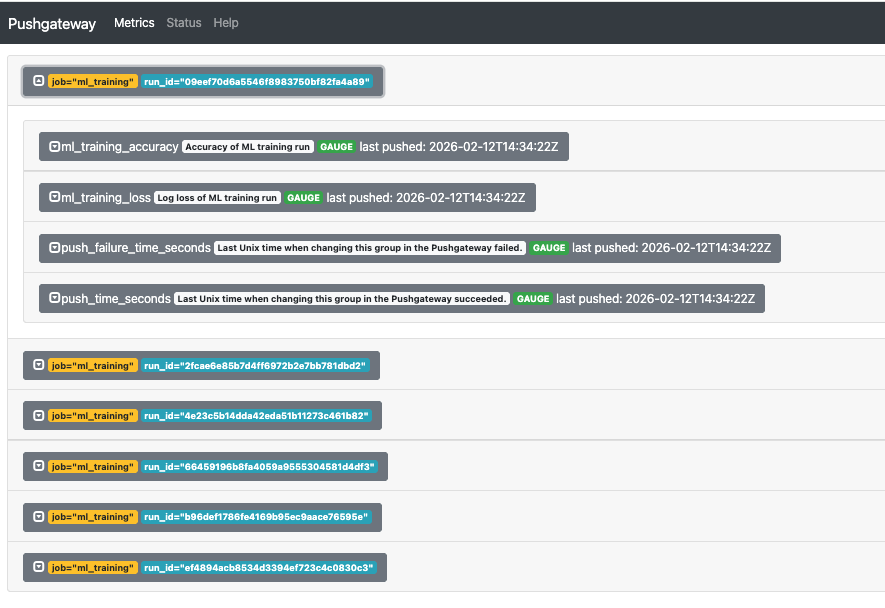
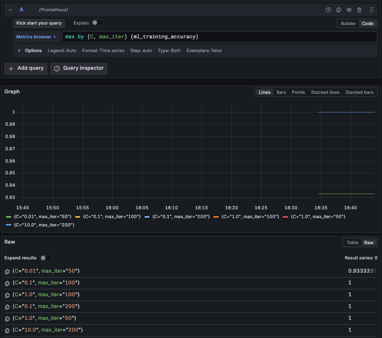

> **Disclaimer:** Облікові дані (паролі, ключі), що зазначені в цьому репозиторії, використовуються виключно для спрощення в навчальних цілях. У production-середовищі слід використовувати Kubernetes Secrets, Sealed Secrets або зовнішні менеджери секретів (AWS Secrets Manager, HashiCorp Vault тощо).

## Підключення до кластера

```bash
aws eks --region us-east-1 update-kubeconfig --name goit --alias goit-eks
kubectl config use-context goit-eks
```

## Перевірка наявності сервісів у кластері

```bash
# Перевірити pods MLflow
kubectl get pods -n application

# Перевірити pods моніторингу
kubectl get pods -n monitoring

# Перевірити ArgoCD Applications
kubectl -n infra-tools get applications
```

## Port-forward

```bash
# ArgoCD UI (порт 8080)
kubectl -n infra-tools get secret argocd-initial-admin-secret -o jsonpath="{.data.password}" | base64 -d
kubectl port-forward svc/argocd-server -n infra-tools 8080:80
```



## Запуск експерименту

### 1. Налаштування оточення

```bash
cd experiments
python -m venv .venv
source .venv/bin/activate
pip install -r requirements.txt
cp .env.example .env
# Відредагуйте .env за потреби
```

### 2. Запуск port-forward (в окремих терміналах)

```bash
kubectl port-forward -n application svc/mlflow 5000:5000
kubectl port-forward -n application svc/minio 9000:9000
kubectl port-forward -n monitoring svc/pushgateway-prometheus-pushgateway 9091:9091
```

### 3. Запуск тренування

```bash
python train_and_push.py
```

Скрипт виконує 6 запусків з різними гіперпараметрами (`C`, `max_iter`), логує результати в MLflow та надсилає метрики до PushGateway. Найкраща модель зберігається у `best_model/`.

## Перегляд результатів

### MLflow UI

```bash
kubectl port-forward -n application svc/mlflow 5000:5000
# Відкрити http://localhost:5000
```


### PushGateway

```bash
kubectl port-forward -n monitoring svc/pushgateway-prometheus-pushgateway 9091:9091
# Відкрити http://localhost:9091
# Метрики: ml_training_accuracy, ml_training_loss
```


### Grafana

```bash
kubectl port-forward -n monitoring svc/prometheus-operator-grafana 3000:80
# Відкрити http://localhost:3000
# Логін: admin / prom-operator
```

**Перегляд метрик:**
1. Перейти до **Explore** (іконка компаса)
2. Обрати datasource **Prometheus**
3. Переключити на режим **Code**
4. Ввести запит:
   - Accuracy: `max by (C, max_iter) (ml_training_accuracy)`
   - Loss: `max by (C, max_iter) (ml_training_loss)`
6. Натиснути **Run query**


